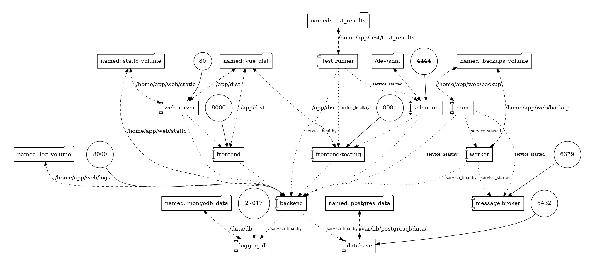

# Racks
**Racks** is a prototype of a space accounting system for telecommunication cabinets and racks.

### Stack:
     
    
  

### Tools and more:
    
   
     
   
    


### Docker-compose profiles:

For dev environment run:
```
docker-compose --profile dev up
```
For dev environment plus E2E tests run:
```
docker-compose --profile test up
```


|  |
|:--:| 
| *Racks map* |

|  |
|:--:| 
| *Rack scheme* |

|  |
|:--:| 
| *Device card* |
