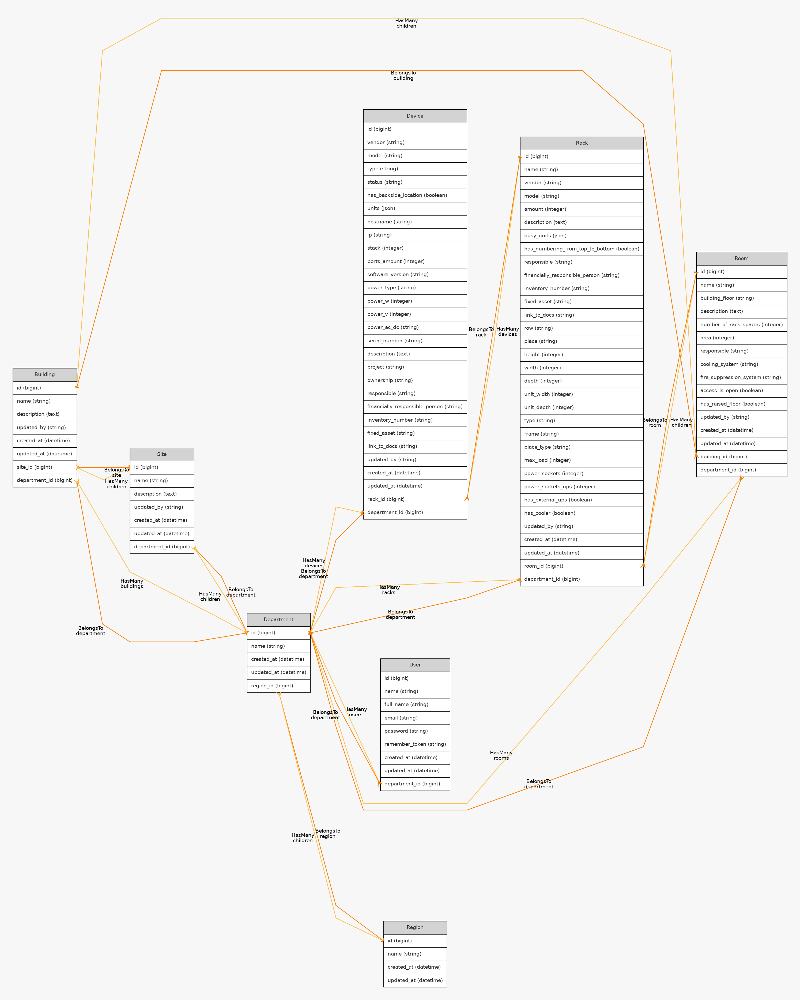

# Racks
**Racks** is a prototype of a space accounting system for telecommunication cabinets and racks.

## Stack:
    
   


## Tools:
     
     
        
   

## For dev environment:
Needs `docker` and `laravel/sail` to be installed.
```
./vendor/bin/sail up
```

## build_and_test.sh:

Check `NUMBER_OF_THREADS` and `SHM_SIZE` envs before start!  
HTML-reports and screenshots are stored in relevant docker volumes. Each run logs stored in `./build_logs` directory.

## CLI:
Administrative purpose commands for artisan via sail:
```
./vendor/bin/sail artisan `command` {args}
```
Region:
```
create:region {name}
delete:region {id}
update:region {id} {name}
```
Department:
```
create:department {name} {region_id}
delete:department {id}
update:department {id} {name}
```
User:
```
make:user {name} {full_name} {email} {department_id}
delete:user {id}
reset_password:user {id}
update:user {id} {name} {full_name} {email} {department_id}
```

## Docs:
### Swagger:
```
http://localhost:80/api/documentation
```
### Business rules example:
[/app/Domain/Interfaces/RackInterfaces/RackBusinessRules.php](/app/Domain/Interfaces/RackInterfaces/RackBusinessRules.php)

## Models graph:
|  |
|:-------------------:|

## Screenshots:
|  |
|:--:| 
| *Racks map* |

|  |
|:--:| 
| *Rack scheme* |

|  |
|:--:| 
| *Device card* |


